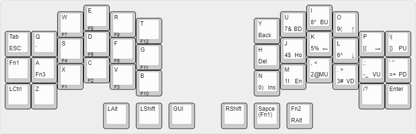

# My first split keyboard
Canter keyboard making log

## Template
It should be **easy to make** because I am chobo(noob).  
So I selected [**cantor keyboard**](https://github.com/diepala/cantor)(Classic).

These are the factors I took into consideration when choosing a template.
1. Simple
2. Diodeless
3. Easy to build
4. Easy to flash the firmware

## Bill of materials
  |Component|Required|Ordered|Amount|
  |-|-|-|-|
  |PCB|2|5|$19.60 (₩27,161)|
  |Microcontrollers (STM32F401CCU6)|2|2|$7.63 (₩10,571)|
  |Switches (Choc v1 Pink)|42|60|$28.95 (₩40,100)|
  |Keycaps (CHOSFOX Choc white transparent)|42|50|$24.20 (₩33,517)|
  |TRRS jacks (PJ320A DIP)|2|10|$3.31 (₩4,589)|
  |TRRS cable|1|1|$5.49 (₩7,600)|
  |Type-C cable|1|0|-|

**A total of $89.18 (₩123,538)**. (And additional about $8 for soldering equipment)

## Build
I just followed [build guide](https://github.com/diepala/cantor/blob/main/doc/build_guide.md).  
Actually, it wasn't difficult at all.  

  
I used an old mouse pad instead of a silicone bumper to prevent slipping.  

## Flash the firmware and test
I followed [qmk docs](https://docs.qmk.fm/#/newbs).  
And I used wsl2.  

For test, I built the firmware with the default keymap.  
But, a problem arose during the process of flashing the firmware.  
When I ran the `qmk flash` command, the bootloader was not detected.  
The USB device connected to Windows could not be used in WSL.  

So, I found [how to use usb device connected to Windows in WSL](https://learn.microsoft.com/en-US/windows/wsl/connect-usb).  
I succeeded in flashing the firmware on WSL using this method(usbipd-win).  

And after some testing, I found out the following:  
- Firmware must be flashed on both controllers
- When the left controller is connected to a computer, it operates with the keymap set in the left controller's firmware.
- When the right controller is connected to a computer, it operates with the keymap set in the right controller's firmware.

This means I need to flash the firmware on both devices, but applying different keymaps to both allow me to easily switch to a different key map by switching connections.  

Anyway, all keys worked normally.  

## Keymap
After much thought, I created my own keymap.

Top left - base layer (when holding, the key in parentheses)  
Bottom left - Fn1 layer  
Bottom right - Fn2 layer  
Front left - Fn3 layer  
